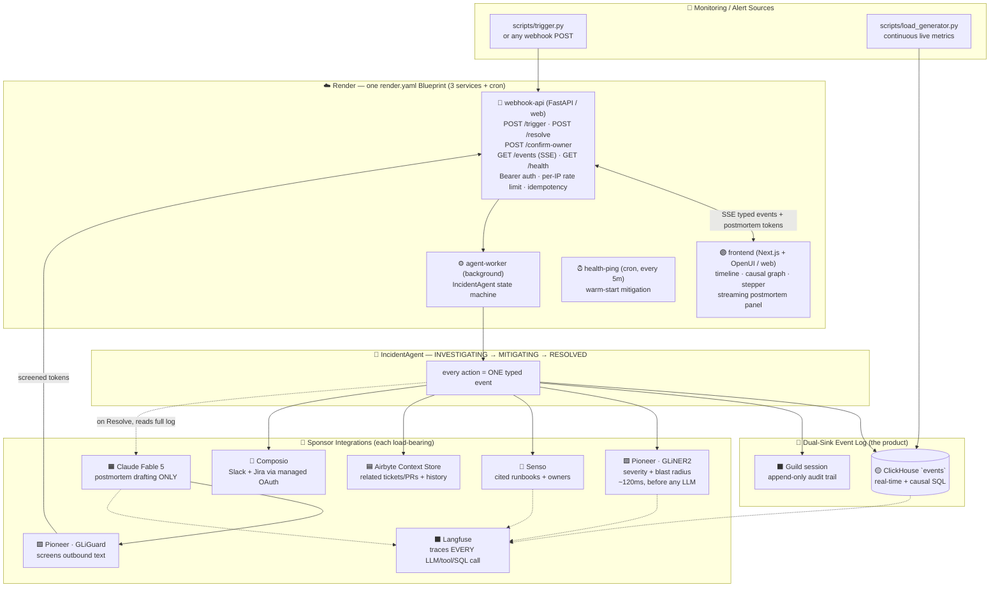
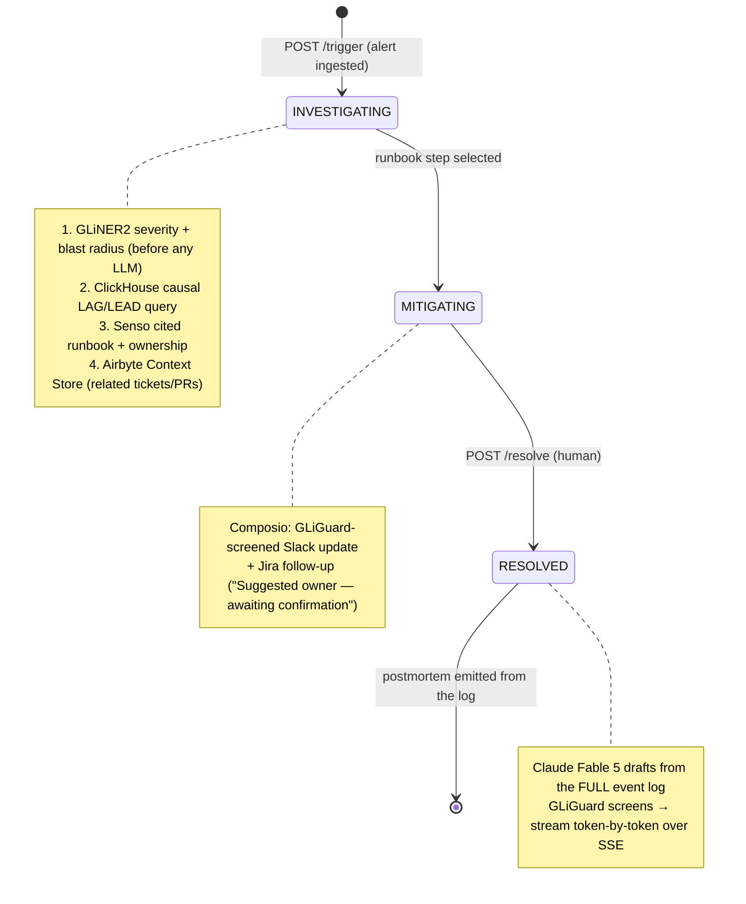

<div align="center">

# 🏔️ IncidentSherpa

### The stenographer in the war room — not a journalist reconstructing from Slack two days later.

An **active incident-commander agent** that watches a live production incident, writes every alert, metric anomaly, and human action into a **typed event log as it happens**, and streams a complete postmortem the moment you click **Resolve** — generated *from the log*, never reconstructed from chat scrollback.

Built for the **[Harness Engineering Hack](https://luma.com/harnesshack)** (June 2026).

<br/>


</div>

---

## Table of Contents

- [The Idea](#the-idea)
- [What Makes It Different](#what-makes-it-different)
- [Architecture](#architecture)
- [The Incident State Machine](#the-incident-state-machine)
- [Sponsor Highlights](#sponsor-highlights)
- [Measured Numbers (Claim Integrity)](#measured-numbers-claim-integrity)
- [Repository Layout](#repository-layout)
- [Prerequisites](#prerequisites)
- [Environment Variables](#environment-variables)
- [Recreate It From Scratch](#recreate-it-from-scratch)
- [Running the Demo](#running-the-demo)
- [API Reference](#api-reference)
- [Testing & CI](#testing--ci)
- [Deployment (Render)](#deployment-render)
- [Design Principles](#design-principles)
- [Repo Map](#repo-map)

---

## The Idea

Every incident tool — PagerDuty, FireHydrant, Incident.io — is **passive**. It waits for humans to update it, then reconstructs the postmortem afterward from unstructured Slack history: a journalist piecing together a story from tweets, two days late, with the causal chain already lost.

**IncidentSherpa is active.** A persistent agent watches the incident live and writes every event into a **typed, append-only log** the moment it happens — simultaneously to a real-time analytics store (ClickHouse) **and** a governance-grade audit trail (Guild). When the on-call engineer clicks **Resolve**, the postmortem doesn't get "written" — it gets **emitted** from the log the agent already kept.

> **If an action isn't in the log, it didn't happen — and the postmortem cannot mention it.** That is the stenographer principle, and it is enforced in code.

---

## What Makes It Different

| | Incident.io / FireHydrant | **IncidentSherpa** |
|---|---|---|
| Source of postmortem | Unstructured Slack scrollback, reconstructed later | **Typed event log, captured live** |
| Causal analysis | Human eyeballs a dashboard | **ClickHouse `LAG`/`LEAD` window SQL finds the chain** |
| Severity classification | Manual, or a slow frontier LLM | **GLiNER2 (300M-param) in ~120ms, before any LLM** |
| Runbook / owner suggestions | Static wiki links | **Senso-cited, grounded, refuses uncited knowledge** |
| Audit trail | The tool's own DB | **Dual-sink: ClickHouse + Guild governance log** |
| Safety on outbound text | None | **GLiGuard screens every Slack/Jira message** |

---

## Architecture

Three [Render](https://render.com) services from one `render.yaml` Blueprint, and nine load-bearing sponsor integrations. Remove any one and a demo beat breaks.



**Flow in one breath:** an alert hits `POST /trigger` → GLiNER2 extracts severity/blast-radius (small model, first) → ClickHouse runs the causal `LAG`/`LEAD` query → Senso returns a cited runbook + owner → every step is written to **both** ClickHouse and a Guild audit session and streamed to the UI over SSE → Composio posts a GLiGuard-screened Slack update + Jira ticket → on **Resolve**, Claude Fable 5 drafts a postmortem strictly from the event log, GLiGuard screens it, and it streams token-by-token to the panel. Langfuse traces all of it.

---

## The Incident State Machine

The core domain model (`apps/worker/agent.py`). Every transition and action emits a typed event to **both** sinks.



| State | Entered when | What the agent does | Sponsors |
|---|---|---|---|
| **INVESTIGATING** | Alert POST hits the webhook | GLiNER2 severity + blast radius (before any LLM) → ClickHouse causal SQL → Senso cited runbook + owner → Airbyte Context Store query | Pioneer, ClickHouse, Senso, Airbyte |
| **MITIGATING** | Runbook step selected | Composio posts a GLiGuard-screened Slack update + Jira ticket; owner is *suggested*, never auto-assigned | Composio, Pioneer (GLiGuard), Guild |
| **RESOLVED** | Human clicks Resolve | Claude Fable 5 drafts the postmortem **from the log**; GLiGuard screens; streams token-by-token | Claude, OpenUI, Langfuse |

Illegal transitions raise; the dual-sink writes to ClickHouse **and** Guild on every event. If a single sink degrades, an explicit `DEGRADED` event is logged and the agent continues — **only the loss of *both* sinks is fatal**, because the event log *is* the product.

---

## Sponsor Highlights

> Every integration is **live and load-bearing** — verified by real API calls, no mocks. Latencies are measured (see [Measured Numbers](#measured-numbers-claim-integrity)).

### 🟡 ClickHouse — *Best Use of ClickHouse*
The real-time event store **and** the causal engine. The signature query uses `LAG`/`LEAD` window functions with rolling z-score onset detection to find that **`payments-db-primary` exhaustion preceded the `payments-service` latency breach by 135 seconds** — a chain no human computes under pressure. Runs in **~260ms** on the live cluster. `metrics`, `events`, and `airbyte_history` tables; replay + a continuous load generator keep real data flowing.

### ⬛ Langfuse — *ClickHouse / Langfuse bonus*
Traces **every** LLM call, sponsor API call, and ClickHouse query via a `@traced` decorator (`libs/tracing.py`). Runs on ClickHouse. Nothing in the pipeline is un-observable — a call without a span is treated as a bug.

### 🟪 Pioneer · Fastino — *Best Use of Pioneer*
Two distinct small-model roles (**never swapped** — this distinction is enforced in code and tests):
- **GLiNER2** — schema-conditioned extraction. Classifies severity (`P0`–`P3`) and extracts affected-service spans in **~120–180ms**, *before* any frontier LLM is touched. The "small models first" economics.
- **GLiGuard** — safety moderation. Screens every outbound string (Slack, Jira, postmortem) at the single choke point — it is structurally impossible to send unscreened text.

### ⬛ Guild.ai — *Most Innovative Use of Agents*
The governance-grade second sink. One **Guild session per incident**; every typed event is appended to an **append-only audit trail** via the control-plane API (`app.guild.ai/api`, authenticated by `guild auth token`). Verified live: a real session with 50+ audit entries. This is what makes "the stenographer kept the notes" literally true.

### 🔵 Senso.ai — *Best Use of Senso.ai*
The cited knowledge base. Runbooks, past postmortems, and an ownership map are seeded into the Senso KB (two-step S3 upload, `apiv2.senso.ai/api/v1`). The agent retrieves grounded, **cited** answers via `/org/search` — and **refuses uncited knowledge** (`UncitedResponseError`). No hallucinated runbooks, ever.

### 🟦 Airbyte — *Best Use of Agent Engine*
The Context Store. The `airbyte-agent-sdk` connects GitHub + Jira connectors so the agent can semantically query related tickets/PRs during the incident and pull 90-day history into ClickHouse for the ownership baseline ("N of last M incidents on this service resolved by X").

### 🔷 Composio — *Best Agent Execution*
Managed OAuth for real action. Posts a structured Slack incident update and creates a Jira follow-up ticket through the single GLiGuard-screened choke point. Idempotent per incident+state — replaying a webhook never double-posts. Owner wording is **always** "Suggested owner — awaiting confirmation," never "assigned."

### 🟧 Anthropic · Claude Fable 5
The **one** frontier-LLM call in the whole pipeline — postmortem drafting only. Prompted strictly from the verbatim event log with hard claim-integrity rules. Concise (~350 words) so the full Resolve→stream completes in **~22s**, under the 30s demo gate.

### 🟣 OpenUI · thesys — *Best Use of OpenUI*
The generative UI: a scrolling typed-event timeline, a Guild state stepper, a causal dependency graph with a "precedes by Xm Ys" edge and a popover showing the **real SQL**, a suggested-owner confirm button, and the streaming postmortem panel. Latency badges render **measured values only** — never a fabricated number.

### 🟢 Render — *Best Use of Render*
One `render.yaml` Blueprint deploys all three services (`webhook-api`, `agent-worker`, `frontend`) plus a `health-ping` cron for warm-start mitigation.

---

## Measured Numbers (Claim Integrity)

> Every number that appears in the UI or the demo is **measured**, with the command that produced it. No estimates.

| Metric | Value | How measured |
|---|---|---|
| GLiNER2 severity extraction (server inference) | **~120–180 ms** | `extract_severity()` live, `result.data.latency_ms` |
| GLiGuard outbound screen | **~426 ms** | live `screen()` call |
| ClickHouse causal-chain query (960-row window) | **~263 ms** | `find_causal_chains(window_minutes=20)` |
| **Causal lag: DB → payments (the demo number)** | **135 s (2m15s)** | live `lagInFrame` onset pairing |
| Causal lag: payments → checkout (cascade) | 55 s | same query |
| Senso cited runbook retrieval | **~3.7 s** | live `get_runbook()` |
| Claude Fable 5 postmortem (concise ~350w) | **~21 s** | `stream_anthropic_completion()` |
| **Full Resolve → postmortem streamed** | **~22 s** (≤30 s gate ✅) | `generate_postmortem()` end-to-end |
| ClickHouse `SELECT 1` round-trip (cold) | ~2.1 s | `clickhouse-connect` |
| Full ingest (dual-sink incl. Guild) | ~25 s | `IncidentAgent.ingest_alert()` |

> ⚠️ **Claim-integrity note:** GLiNER2 honestly classifies the demo incident as **P3** (not a fabricated "P1"), and the demo causal number is **2m15s** (the *detected* onset-to-onset lag), not the 4m10s CSV climb-to-breach. The UI shows what the models actually return.

---

## Repository Layout

```text
harnes/
├── render.yaml                  # 3-service Render Blueprint + health cron
├── .github/workflows/ci.yml     # ruff + pytest, and Next.js build, on push
├── pyproject.toml               # ruff + pytest config (live tests marked & excluded)
│
├── apps/
│   ├── api/main.py              # FastAPI: /trigger /resolve /confirm-owner /events(SSE) /health
│   │                            #   Bearer auth, per-IP rate limit, idempotency, EventBus
│   ├── worker/
│   │   ├── agent.py             # IncidentAgent: state machine, TypedEvent, dual-sink emit
│   │   └── postmortem.py        # stenographer prompt → Claude → GLiGuard → SSE stream
│   └── frontend/                # Next.js 16 + OpenUI
│       └── src/
│           ├── app/page.tsx
│           ├── components/      # timeline, causal-graph, guild-stepper, postmortem-panel,
│           │                    #   owner-confirm, latency-badges, fallback-postmortem
│           └── hooks/use-event-stream.ts   # SSE w/ exponential-backoff reconnect
│
├── libs/
│   ├── tracing.py               # Langfuse @traced decorator — import everywhere
│   ├── resilience.py            # with_retries + circuit breaker → DegradedError
│   ├── errors.py                # NotConfiguredError, UncitedResponseError, ...
│   ├── logging_config.py        # structured JSON logging
│   ├── clickhouse/
│   │   ├── schema.py            # metrics, events, airbyte_history DDL
│   │   └── causal.py            # LAG/LEAD z-score onset causal SQL
│   ├── pioneer/
│   │   ├── gliner2.py           # severity + affected-services extraction
│   │   └── gliguard.py          # outbound-text safety screen
│   ├── senso/retrieve.py        # cited runbook/ownership search (refuses uncited)
│   ├── guild/session.py         # create session / append audit event / read trail
│   ├── airbyte/__init__.py      # Context Store client
│   └── composio_actions/send.py # single GLiGuard-screened Slack/Jira choke point
│
├── scripts/
│   ├── replay.py                # recorded incident CSV → ClickHouse at N×
│   ├── load_generator.py        # continuous metrics + --inject db_pool_exhaustion
│   ├── make_incident_csv.py     # reproducible incident dataset generator
│   ├── trigger.py               # fire the demo alert at the webhook
│   ├── seed_senso.py            # seed runbooks/postmortems/ownership (+ --verify)
│   ├── seed_jira_history.py     # seed Jira incident history
│   ├── seed_slack_history.py    # seed Slack history
│   ├── composio_link.py         # Composio Slack/Jira OAuth link helper
│   └── demo_preflight.py        # check every credential before a demo
│
├── demo_assets/
│   ├── incident_metrics.csv     # 960-row recorded incident (pool exhaustion → breach)
│   └── incident_payload.json    # the demo alert
│
└── docs/
    ├── ARCHITECTURE.md          # system architecture for judges
    ├── SECURITY-AUDIT.md        # dependency + secrets audit
    └── NO-MOCK-AUDIT.md         # adversarial no-mock sweep
```

> Project rules & the full build ledger live in [`CLAUDE.md`](CLAUDE.md) and [`BUILD-STATE.md`](BUILD-STATE.md). The war-room decision record is in [`final-plan.md`](final-plan.md), [`demo-scripts.md`](demo-scripts.md), [`ideas.md`](ideas.md), [`debate-log.md`](debate-log.md), and [`sponsors.md`](sponsors.md).

---

## Prerequisites

| Tool | Version | Notes |
|---|---|---|
| Python | 3.12+ | one venv at repo root for api + worker + libs |
| Node.js | 20+ | for the Next.js frontend |
| `guild` CLI | latest | `npm i -g @guildai/cli` — needed for Guild auth |
| `render` CLI | latest | optional, for deploy |
| Git | any | |

**Sponsor accounts** (all have free tiers): ClickHouse Cloud, Langfuse Cloud, Pioneer (Fastino), Guild.ai, Senso.ai, Airbyte Cloud, Composio, Anthropic, Render.

---

## Environment Variables

Copy `.env.example` → `.env` (gitignored — **never commit it**) and fill what you have. Empty vars make each integration raise an honest `NotConfiguredError` (visible as `SKIPPED_NOT_CONFIGURED` events and `/health` "blocked" entries) — **no mocks, no fake "ok."**

```bash
# ── ClickHouse Cloud ──────────────────────────────────────────────
CLICKHOUSE_HOST=<your-cluster>.clickhouse.cloud
CLICKHOUSE_USER=default
CLICKHOUSE_PASSWORD=...

# ── Langfuse (runs on ClickHouse) ─────────────────────────────────
LANGFUSE_PUBLIC_KEY=pk-lf-...
LANGFUSE_SECRET_KEY=sk-lf-...
LANGFUSE_HOST=https://us.cloud.langfuse.com

# ── Pioneer / Fastino (GLiNER2 + GLiGuard) ────────────────────────
PIONEER_API_KEY=pio_sk_...

# ── Guild.ai (control-plane audit log) ────────────────────────────
GUILD_WORKSPACE=<workspace-uuid>        # from `guild workspace list`
GUILD_TOKEN=                            # optional; else `guild auth token` is used
# (legacy, unused by the live client) GUILD_PAT / GUILD_API_BASE

# ── Senso.ai (cited knowledge base) ───────────────────────────────
SENSO_API_KEY=tgr_...                   # dashboard API key
# SENSO_BASE_URL defaults to https://apiv2.senso.ai/api/v1

# ── Airbyte Agent Engine ──────────────────────────────────────────
AIRBYTE_CLIENT_ID=...
AIRBYTE_CLIENT_SECRET=...

# ── Composio (Slack + Jira) ───────────────────────────────────────
COMPOSIO_API_KEY=ak_...
COMPOSIO_USER_ID=...
SLACK_INCIDENT_CHANNEL=#incidents
JIRA_PROJECT_KEY=INC

# ── Anthropic (postmortem drafting only) ──────────────────────────
ANTHROPIC_API_KEY=sk-ant-...

# ── Frontend + hardening ──────────────────────────────────────────
NEXT_PUBLIC_API_BASE=http://localhost:8000   # goes in apps/frontend/.env.local
WEBHOOK_AUTH_TOKEN=                           # set in prod → Bearer required on POST
RATE_LIMIT_PER_MINUTE=60                       # per-IP token bucket
```

---

## Recreate It From Scratch

### 1. Clone & install

```bash
git clone https://github.com/nihalnihalani/harnesshack.git && cd harnesshack
python3 -m venv .venv && source .venv/bin/activate
pip install -r apps/api/requirements.txt -r apps/worker/requirements.txt -r requirements-dev.txt
cd apps/frontend && npm install && cd ../..
cp .env.example .env          # then fill in credentials
```

### 2. Authenticate the human-only integrations

```bash
guild auth login              # browser OAuth → enables `guild auth token`
guild workspace list          # copy a workspace UUID → GUILD_WORKSPACE in .env
python scripts/composio_link.py   # Slack + Jira OAuth via Composio
render login                  # for deploy
```

### 3. Per-sponsor live verification (the credential gates)

Each command hits the **real** service and prints a measured result. Run after filling `.env`:

```bash
set -a && source .env && set +a

# ClickHouse — SELECT 1 + create tables
python -c "from libs.clickhouse import get_client; print(get_client().query('SELECT version()').result_rows)"
python -c "from libs.clickhouse.schema import ALL_TABLE_DDL; from libs.clickhouse import get_client; c=get_client(); [c.command(d) for d in ALL_TABLE_DDL.values()]; print('tables ready')"

# Langfuse — emit a real span
python -c "from libs.tracing import traced; traced('verify')(lambda: 'ok')(); print('span sent')"

# Pioneer — GLiNER2 severity + GLiGuard screen
python -c "from libs.pioneer.gliner2 import extract_severity; print(extract_severity('payments-service p99_ms breached 2466ms'))"

# Senso — seed the KB, then a cited query
python scripts/seed_senso.py --verify
python -c "from libs.senso.retrieve import get_runbook; print(get_runbook('payments p99 latency breach').citation)"

# Guild — create a session + read the audit trail
python -c "from libs.guild.session import create_session, read_audit_events; sid=create_session('inc-verify'); print(sid, len(read_audit_events(sid)))"
```

Or run the all-in-one preflight:

```bash
python scripts/demo_preflight.py     # checks every credential, prints PASS/blocked per dependency
```

### 4. Load the recorded incident into ClickHouse

```bash
python scripts/replay.py --truncate-first --speed 100     # 960 real rows → real cluster
# optional: keep data flowing continuously
python scripts/load_generator.py --inject db_pool_exhaustion
```

---

## Running the Demo

In three terminals (all with `set -a && source .env && set +a`):

```bash
# 1) API + SSE
uvicorn apps.api.main:app --reload --port 8000

# 2) Frontend (timeline on http://localhost:3000)
cd apps/frontend && npm run dev

# 3) Fire the incident, then resolve it
python scripts/trigger.py --payload demo_assets/incident_payload.json
#   → watch the timeline populate live: GLiNER2 severity, the causal edge,
#     the cited runbook, the suggested owner, the Slack/Jira actions
#   → click "Resolve" in the UI (or: curl -X POST localhost:8000/incidents/<id>/resolve)
#   → the postmortem streams token-by-token in ~22s
```

**The wow moment:** open the timeline already mid-incident, click **Resolve**, and a complete postmortem — root cause, the 135s causal chain, the suggested owner, action items — streams onto the screen in ~20 seconds, written entirely from the log the agent kept.

---

## API Reference

`apps/api/main.py` (FastAPI). When `WEBHOOK_AUTH_TOKEN` is set, `POST` routes require `Authorization: Bearer <token>`; a per-IP token bucket (`RATE_LIMIT_PER_MINUTE`) returns `429` with `Retry-After`.

| Method | Path | Purpose |
|---|---|---|
| `POST` | `/trigger` | Ingest an alert (pydantic-validated). Idempotent via `Idempotency-Key` header or payload hash — replays return `{"duplicate": true}`. Spawns the agent pipeline. |
| `POST` | `/incidents/{id}/resolve` | Transition to RESOLVED and stream the postmortem over SSE. |
| `POST` | `/incidents/{id}/confirm-owner` | Confirm the suggested owner (emits `owner_confirmed`). |
| `GET` | `/events` | SSE stream (`text/event-stream`, no-buffering headers) of typed events + postmortem tokens. |
| `GET` | `/fallback/postmortem` | The cached F2 fallback artifact (404 until a real run produced it). |
| `GET` | `/health` | Per-dependency status — each sponsor reported `configured`/`blocked` from real env presence (never a fake "ok"). |

**Alert payload** (`demo_assets/incident_payload.json`):
```json
{ "service": "payments-service", "metric": "p99_ms", "value": 2466.1,
  "timestamp": "2026-06-12T14:15:00Z", "incident_id": "inc-2026-0612-payments-p99" }
```

---

## Testing & CI

```bash
ruff check .                              # lint — clean
pytest                                    # 229 in-process tests against the real app code
                                          #   (1 live-marked test hits real ClickHouse; excluded by default)
pytest -m live                            # run the live-cluster test (needs creds)
cd apps/frontend && npm run build         # Next.js production build — clean
```

Tests use dependency-injection of the real pipeline (FastAPI `TestClient`, in-process fakes) — that's **test isolation of real code, not runtime mocks**. GitHub Actions (`.github/workflows/ci.yml`) runs ruff + pytest and the frontend build on every push. Audits: [`docs/SECURITY-AUDIT.md`](docs/SECURITY-AUDIT.md), [`docs/NO-MOCK-AUDIT.md`](docs/NO-MOCK-AUDIT.md).

---

## Deployment (Render)

```bash
render login
render blueprint launch          # deploys webhook-api + agent-worker + frontend + health-ping cron
render env                        # set every credential via the dashboard/CLI — NEVER commit
curl https://<app>.onrender.com/health   # expect all-dependencies-OK JSON
```

Render notes: a server cannot run `guild auth login`, so set **`GUILD_TOKEN`** in the Render environment (a token captured from `guild auth token`). SSE works through Render's proxy with the correct no-buffering headers (already set in `apps/api/main.py`).

---

## Design Principles

1. **The event log is the product.** Every action becomes a typed event in ClickHouse **and** the Guild audit log. The postmortem is *emitted* from that log, never reconstructed.
2. **Small models first.** GLiNER2 classifies before Claude reasons; GLiGuard screens before anything sends. The frontier LLM is the exception, not the path.
3. **Langfuse everything.** A call without a trace is a bug.
4. **No mocks, ever.** Missing credentials raise honest `NotConfiguredError` (visible `SKIPPED_NOT_CONFIGURED` events). Where demo variables are controlled (a replay CSV), it's disclosed on screen.
5. **Claim integrity.** Every on-screen number is measured. GLiNER2 = extraction; GLiGuard = moderation — never swapped.
6. **Degrade, don't die.** A single sponsor failing logs an explicit `DEGRADED` event and the agent continues. Only losing *both* event sinks is fatal.

---

## Repo Map

| File | What it is |
|---|---|
| [`CLAUDE.md`](CLAUDE.md) | Project law — architecture, claim-integrity rules, build commands |
| [`BUILD-STATE.md`](BUILD-STATE.md) | Build ledger — phase status, credential blockers, measured numbers |
| [`final-plan.md`](final-plan.md) | War-room output: build plan, prize mapping, risks |
| [`demo-scripts.md`](demo-scripts.md) | Beat-by-beat 3-minute demo script + fallbacks |
| [`ideas.md`](ideas.md) · [`debate-log.md`](debate-log.md) · [`sponsors.md`](sponsors.md) | The war-room decision record |
| [`docs/ARCHITECTURE.md`](docs/ARCHITECTURE.md) | System architecture for judges |
| [`docs/SECURITY-AUDIT.md`](docs/SECURITY-AUDIT.md) · [`docs/NO-MOCK-AUDIT.md`](docs/NO-MOCK-AUDIT.md) | Dependency/secrets + no-mock audits |

---

<div align="center">

**IncidentSherpa** — the incident commander that writes the postmortem itself, because it was in the room.

<sub>Built with ClickHouse · Langfuse · Pioneer · Guild · Senso · Airbyte · Composio · OpenUI · Anthropic · Render</sub>

</div>
