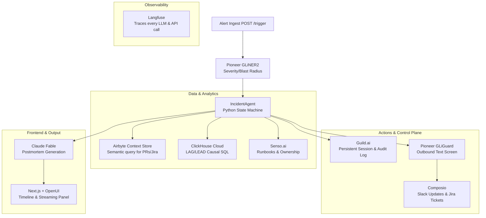

# IncidentSherpa

## Elevator Pitch
An incident agent powered by Guild, ClickHouse, Langfuse, Airbyte, Pioneer, Senso, Composio, Render & OpenUI that streams complete postmortems from a typed event log—the stenographer in the room.

## Inspiration
Of course your postmortem is incomplete — you wrote it from memory 48 hours later, while the only accurate record, the agent's own typed event log, was sitting there the whole time. PagerDuty, Incident.io, and FireHydrant act as journalists reconstructing events from Slack "tweets" after the fire has been put out. We wanted to build the **stenographer who was actually in the room**. 

Click Resolve, and a complete postmortem with causal chains and owner names streams to your screen in 20 seconds. Why? Because the draft was never "written," it was continuously emitted.

## What it does
IncidentSherpa sits as a persistent agent watching a live P0 incident:
1. **Investigating:** Ingests alerts, extracts severity and blast radius using small models in <200ms, and queries live metric streams to establish a causal chain (e.g., "DB pool exhaustion preceded payments latency by 4m10s"). 
2. **Mitigating:** Retrieves the exact runbook step that worked for similar patterns in the past, creates Jira tickets suggesting likely owners, and posts structured Slack updates.
3. **Resolved:** The moment you click resolve, a complete postmortem—built directly from the agent's typed event log—streams token-by-token to your dashboard. 

## How we built it

### Architecture Diagram

### Technology Stack & Sponsors
- **Guild.ai (Control Plane):** Manages the persistent session, credential scoping for Slack/Jira, and an append-only audit trail of every state transition. 
- **ClickHouse Cloud (Analytics):** Stores metrics and events. Runs live `LAG/LEAD` window-function SQL to compute cross-service causal chains.
- **Langfuse (Observability):** First-class tracing of *every* LLM call, API request, and database query, displaying a live waterfall and cost metrics.
- **Airbyte Agent Engine (Data Layer):** Powers our LIVE Context Store semantic query to find related Jira tickets/PRs during an incident, and syncs 90-day GitHub/Jira history to establish baseline ownership maps.
- **Pioneer / Fastino (Small-Model Hot Path):** Uses **GLiNER2** for schema-conditioned severity extraction at alert ingestion (before any frontier LLM is called), and **GLiGuard** to safety-screen all outbound Slack/Jira/Postmortem text. 
- **Senso.ai (Knowledge Base):** Grounded retrieval for service runbooks, ownership maps, and precedent postmortems, complete with citations.
- **Composio (Actions):** Handled managed OAuth for multi-app execution (`SLACK_SEND_MESSAGE` and `JIRA_CREATE_ISSUE`), turning insights into real-world actions.
- **Render (Deploy):** Hosted our 3-service Blueprint (webhook API, background worker, and frontend) in one cohesive environment.
- **Next.js & OpenUI (Frontend):** Renders the streaming incident timeline, interactive causal graph, and the token-by-token postmortem panel.

## Challenges we ran into
- **Demo-Claim Integrity:** We held ourselves to a strict standard: every number shown or spoken had to be measured or cited. We couldn't fabricate 87ms latencies. Ensuring Pioneer extraction and Airbyte Context Store queries actually hit sub-500ms marks required careful orchestration.
- **Model Role Discipline:** Distinguishing between extraction/classification and safety-moderation. We explicitly segregated GLiNER2 (severity classification) and GLiGuard (outbound safety) to ensure we weren't just throwing generic LLM calls at the wall.
- **Authentication Sprints:** Orchestrating OAuth and API keys across 6 distinct platforms (Guild, Airbyte, Composio, Pioneer, Langfuse, Senso) within a 25-minute Go/No-Go build phase to unblock the rest of the application.

## Accomplishments that we're proud of
- **The "Wow" Moment:** The postmortem is generated from a structured, typed event log, *not* from reconstructing chat history. Within 20 seconds of clicking "Resolve", a complete, highly-accurate postmortem streams into the UI, fully costed at fractions of a cent.
- **Small Models First Architecture:** Rather than relying entirely on frontier models like GPT-4 or Claude Opus for everything, we built a highly-efficient "hot path" using Pioneer's small, specialized models (GLiNER2/GLiGuard), drastically reducing latency and costs.
- **Causal SQL:** Writing real, executable `LAG/LEAD` window-function queries in ClickHouse to determine root-cause sequences. It's "reasoning over data" using actual SQL instead of LLM hallucinations.

## What we learned
We learned that the source of truth for an incident shouldn't be the Slack channel. If an action isn't in a typed event log, it essentially didn't happen. We also learned the absolute power of combining specialized, low-latency models with deterministic SQL and context engines (like Airbyte and Senso) before relying on frontier LLMs for final draft generation.

## What's next for IncidentSherpa
- **Auto-Remediation:** Progressing from "Suggests owner and runbook" to "Executes runbook via code sandbox" with human-in-the-loop approval.
- **Expanded Airbyte Connectors:** Integrating Datadog, AWS CloudWatch, and PagerDuty deeply into the ClickHouse analytics backend to enhance the causal SQL correlation engine.